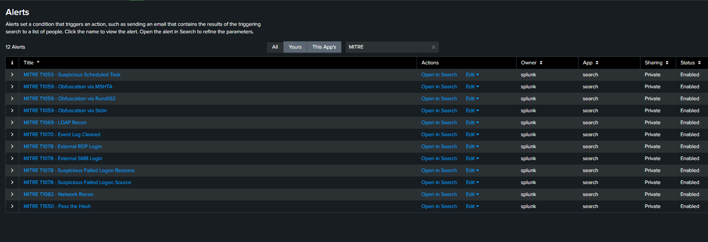
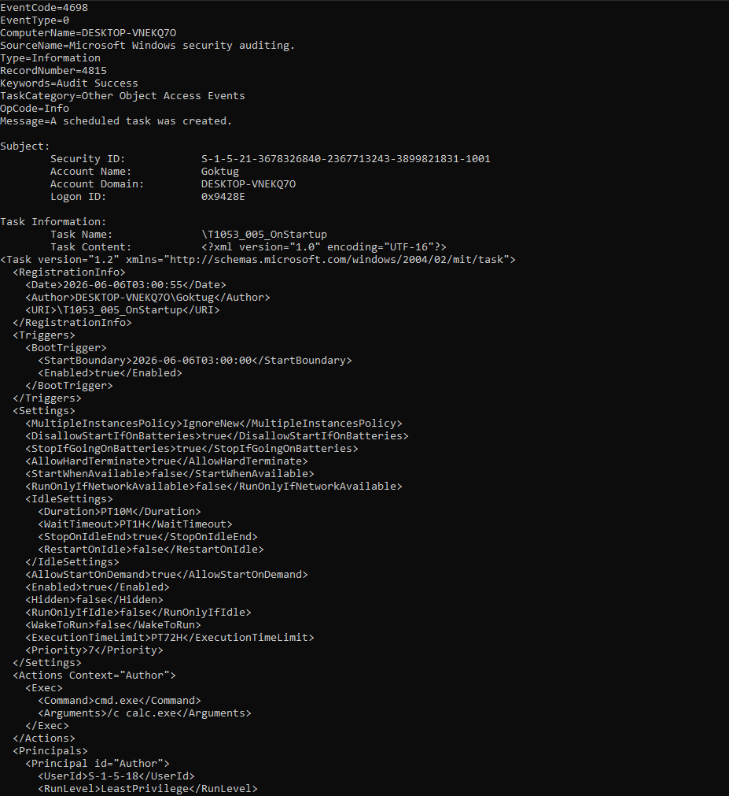
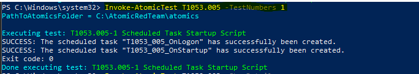
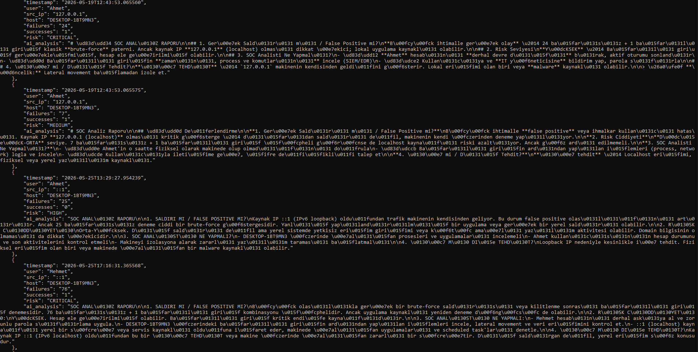

# AI-Powered SOC Automation Platform
A modular SOC automation platform built with Splunk, Python, and Claude AI. Detects threats mapped to MITRE ATT&CK, analyzes them with an AI SOC analyst, and triggers automated incident response — end to end.

<<<<<<< HEAD
A modular SOC automation platform built with Splunk, Python, and Claude AI. Detects threats mapped to **MITRE ATT&CK**, analyzes them with an AI SOC analyst, and triggers automated incident response — end to end.

Each phase is documented on [Medium](https://erensaylan.medium.com/designing-an-ai-powered-soc-automation-platform-with-splunk-and-claude-ai-part-1-d75a173a5f2d).

> **Phase 1** detected brute force only. **Phase 2** added index-time log normalization and a 12-rule MITRE ATT&CK detection engine, validated in a dedicated attack-simulation lab.

---

## Architecture

```
Windows VM (Log Source: Security/System/Application + Sysmon)
        │
        ▼
Universal Forwarder ──► Ubuntu VM (Splunk Enterprise — index-time field normalization)
        │
        ▼
REST API ──► Python (12 MITRE ATT&CK detections + event normalization)
        │
        ▼
Claude API ──► Claude AI Analysis (per-technique MITRE context injection + threat analysis) + SOAR Playbook
        │
        ▼
Email Notification + JSON Incident Log
```

---

## Features

- **MITRE ATT&CK Detection Engine** — 12 detections across 6 tactics, converted from Sigma rules to SPL
- **Brute Force Detection** — advanced detection rules with custom SPL and risk scoring (Phase 1)
- **Risk Scoring** — CRITICAL / HIGH / MEDIUM / LOW severity levels
- **Index-Time Log Normalization** — field extraction in Splunk `props.conf` (no per-query `rename`)
- **AI Analysis** — Claude evaluates each event with injected MITRE context and connects related events into attack chains
- **Automated Alert Management** — `create_alerts.py` creates/updates all Splunk alerts via REST API (idempotent upsert)
- **Automated Email Alerts** — for CRITICAL and HIGH severity incidents
- **Incident Logging** — persistent JSON-based audit trail
- **Multi-Value Field Handling** — localization-aware (supports non-English Windows logs)
- **Machine Account Filtering** — reduces false positives
- **Attack-Simulation Lab** — detections validated with Atomic Red Team + Sysmon telemetry

---

## MITRE ATT&CK Coverage

| Tactic | Technique | Severity | Validation |
|--------|-----------|:--------:|:----------:|
| Defense Evasion | T1070.001 — Clear Event Logs | 🔴 CRITICAL | ✅ Lab |
| Lateral Movement | T1550.002 — Pass-the-Hash | 🔴 CRITICAL | ✅ Lab |
| Persistence | T1053.005 — Scheduled Task | 🟠 HIGH | ✅ Lab |
| Execution | T1059 — Obfuscation via MSHTA | 🟠 HIGH | Pattern |
| Execution | T1059 — Obfuscation via Rundll32 | 🟠 HIGH | Pattern |
| Execution | T1059 — Obfuscation via Stdin | 🟠 HIGH | Pattern |
| Initial Access | T1078 — External RDP Login | 🟠 HIGH | Pattern |
| Initial Access | T1078 — External SMB Login | 🟠 HIGH | Pattern |
| Initial Access | T1078 — Suspicious Failed Logon Reasons | 🟡 MEDIUM | Pattern |
| Initial Access | T1078 — Suspicious Failed Logon Source | 🟡 MEDIUM | Pattern |
| Discovery | T1069 — LDAP Recon | 🟡 MEDIUM | Requires DC |
| Discovery | T1082 — Network Recon | 🟡 MEDIUM | Requires DC |

> **✅ Lab** = fired end-to-end against real telemetry.
> **Pattern** = production-grade rule, validated against known attack patterns.
> **Requires DC** = needs a Domain Controller to generate the relevant events.

---
=======

## Tech Stack

| Component | Technology |
|-----------|------------|
| SIEM | Splunk Enterprise 9.3 |
| Backend | Python 3.10 |
| AI | Claude Sonnet 4.6 (Anthropic) |
| Detection Rules | Sigma → SPL (`sigma-cli`) |
| Attack Simulation | Atomic Red Team + Sysmon (SwiftOnSecurity config) |
| Server OS | Ubuntu Server 22.04 |
| Endpoint OS | Windows 10/11 |
| Log Forwarder | Splunk Universal Forwarder |

---

## Screenshots

### SOAR Pipeline — Multi-Detection Analysis

The orchestration layer runs all 12 MITRE detections, normalizes the results into a single schema, and sends each to Claude AI. Severity banners (CRITICAL / HIGH) drive the response actions.

### MITRE ATT&CK Alerts in Splunk

All 12 detections registered as scheduled alerts (every 5 minutes), with per-technique severity.

### Claude AI — Attack-Chain Analysis

Claude analyzes each event with injected MITRE context and connects related events — e.g. linking a Pass-the-Hash, a log-clear, and two scheduled tasks as a single coordinated intrusion.

### Attack Simulation — Atomic Red Team

Techniques simulated with Atomic Red Team and validated against the resulting Sysmon/Security telemetry in Splunk.

### Splunk Dashboard — Brute Force Detection

Phase 1 dashboard showing brute force activity across all risk levels. CRITICAL and HIGH severity events appear at the top.

### Email Notification

Detailed automated email notifications sent for CRITICAL and HIGH severity events. AI analysis is included in the email body.

### Incident Log File

All detected events are stored with timestamps in `logs/incidents.json`, with AI analysis included.

---

## Risk Scoring Logic (Brute Force)

| Risk | Condition | Action |
|:----:|-----------|--------|
| 🔴 CRITICAL | 20+ failures + 1+ success | Email + Log + AI Analysis |
| 🟠 HIGH | 20+ failures | Email + Log + AI Analysis |
| 🟠 HIGH | 10–20 failures + success | Email + Log + AI Analysis |
| 🟡 MEDIUM | 10–20 failures | Log + AI Analysis |
| 🟡 MEDIUM | 5–10 failures + success | Log + AI Analysis |
| 🟢 LOW | 5–10 failures | Log + AI Analysis |

> MITRE ATT&CK detections use per-technique fixed severity (see coverage table above) rather than count-based scoring.

---

## Installation

**1. Clone & install dependencies**

```bash
git clone https://github.com/thesaep/ai-soc-automation.git
cd ai-soc-automation
pip3 install -r requirements.txt
```

**2. Configure environment**

```bash
cp .env.example .env
# Fill in your values
```

| Key | Description |
|-----|-------------|
| `SPLUNK_HOST` | Splunk server IP |
| `SPLUNK_PORT` | REST API port (default: 8089) |
| `SPLUNK_USERNAME` | Splunk username |
| `SPLUNK_PASSWORD` | Splunk password |
| `SPLUNK_URL` | Full URL (e.g. `https://localhost:8089`) |
| `ANTHROPIC_API_KEY` | Anthropic API key |
| `EMAIL_SENDER` | Gmail address |
| `EMAIL_PASSWORD` | Gmail app password |
| `EMAIL_RECEIVER` | Alert recipient |
| `SEARCH_EARLIEST` | Search window (e.g. `-5m`) |

> Never commit `.env`. It is gitignored. Only `.env.example` (with placeholders) is tracked.

**3. Deploy Splunk field extraction**

```bash
cp splunk/local/props.conf /opt/splunk/etc/system/local/
cp splunk/local/transforms.conf /opt/splunk/etc/system/local/
sudo -u splunk /opt/splunk/bin/splunk restart
```

**4. Create detection alerts**

```bash
python3 create_alerts.py
```

Registers all 12 MITRE detections as scheduled Splunk alerts (`*/5 * * * *`). Re-run any time you update a rule — idempotent upsert will sync the changes.

**5. Run the SOAR pipeline**

```bash
python3 soar_playbook.py
```

---

## Detection Rules (Sigma → SPL)

Community Sigma rules are converted to Splunk SPL:

```bash
sigma convert -t splunk -p splunk_windows <rule.yml> | tr -d '\r' > <rule.spl>
```

Each rule lives in `queries/sigma_converted/<tactic>/` and is loaded at runtime — never hardcoded in Python. Adding a technique means dropping a `.spl` file and adding one line to the detection list.

---

## File Structure

```
ai-soc-automation/
├── README.md
├── .env                         # Secrets (gitignored)
├── .env.example
├── .gitignore
├── requirements.txt
├── splunk_connector.py          # Splunk API connector + event normalization
├── ai_analyzer.py               # Claude AI analyzer + MITRE context injection
├── soar_playbook.py             # Orchestrates all detections + alerts + logging
├── create_alerts.py             # Creates/updates Splunk alerts (idempotent upsert)
├── update_alerts.py             # Updates alert severity + descriptions
├── mitre_context.json           # MITRE technique knowledge base for the AI layer
├── queries/
│   ├── brute_force.spl          # Phase 1 detection (risk-scored)
│   └── sigma_converted/         # 12 Sigma → SPL MITRE rules
│       ├── defense_evasion/
│       ├── discovery/
│       ├── execution/
│       ├── initial_access/
│       ├── lateral_movement/
│       └── persistence/
├── splunk/local/
│   ├── props.conf               # Field extraction (Phase 2 normalization)
│   └── transforms.conf
├── logs/
│   └── incidents.json           # Incident log file
└── screenshots/                 # Project screenshots
```

---

## Write-Ups

| Phase | Medium Article |
|-------|---------------|
| Phase 1 | [Brute-force detection, risk scoring, AI triage, SOAR](https://erensaylan.medium.com/designing-an-ai-powered-soc-automation-platform-with-splunk-and-claude-ai-part-1-d75a173a5f2d) |
| Phase 2 | From one rule to a MITRE ATT&CK detection engine *(coming soon)* |

---

## Roadmap

- [x] **Phase 1** — Brute-force detection + risk scoring + AI triage + SOAR
- [x] **Phase 2** — Log normalization + 12 MITRE ATT&CK detections + test lab + AI context injection
- [ ] **Phase 3** — Multi-event correlation & kill-chain detection
- [ ] **Phase 4** — Multi-tier Splunk architecture (dedicated indexer + search head)
- [ ] **Phase 5** — IOC enrichment (AbuseIPDB, OTX) + dynamic playbooks

---

## License

MIT
