# AI-Powered SOC Automation Platform

A modular SOC automation platform built with Splunk, Python, and Claude AI. Detects threats mapped to **MITRE ATT&CK**, scores and triages them through a cascading pipeline, enriches indicators against live threat intelligence, retrieves precedent from past cases via a local vector store, escalates high-risk events to an AI SOC analyst, correlates multi-event kill-chains, and logs everything to a tamper-evident hash-chain — end to end.

Each phase is documented on [Medium](https://erensaylan.medium.com/).

> **Phase 1** detected brute force only.

> **Phase 2** added index-time log normalization and a 12-rule MITRE ATT&CK detection engine, validated in a dedicated attack-simulation lab.

> **Phase 3** turned it into a reasoning system: 25 detections, a score-based cascading triage layer, kill-chain correlation, and tamper-evident hash-chain logging.

> **Phase 4** gave it context: artifact-driven IOC enrichment (AbuseIPDB + OTX), IOC-aware triage, trend-based escalation, and an L1 throttling layer for continuous operation.

> **Phase 5** gave it memory and judgment: local semantic retrieval (L3 — ChromaDB), a scope-aware analyst knowledge base that separates legitimate infrastructure from real threats, and a clean split between raw event data and multi-source enrichment.

---

## Architecture — L1 → L5

Events flow through a cascading 5-layer pipeline. Each event only reaches the next layer if it survives the previous one — cheap filtering happens before expensive AI analysis.

```
Windows VM (Log Source: Security/System/Application + Sysmon)
        │
        ▼
Universal Forwarder ──► Ubuntu VM (Splunk Enterprise — index-time field normalization)
        │
        ▼   ┌─────────────────────────────────────────────┐
            │ L1  Detection — 25 MITRE ATT&CK SPL queries │
            └─────────────────────────────────────────────┘
        │
        ▼   ┌─────────────────────────────────────────────┐
            │ L2  Cascading Triage — score 0–100          │
            │     ESCALATE ≥60 → L4   MONITOR / SUPPRESS  │
            └─────────────────────────────────────────────┘
        │
        ▼   ┌─────────────────────────────────────────────┐
            │       IOC Enrichment — AbuseIPDB + OTX      │
            │  artifact-driven, cached → feeds L2 score   │
            │  + Knowledge Base check (known-legitimate)  │
            └─────────────────────────────────────────────┘
        │
        ▼   ┌─────────────────────────────────────────────┐
            │ L3  Semantic Retrieval — case memory        │
            │     ChromaDB (all-MiniLM-L6-v2, local)      │
            │     nearest past cases → context for L4     │
            └─────────────────────────────────────────────┘
        │
        ▼   ┌─────────────────────────────────────────────┐
            │ L4  Claude AI — per-event + kill-chain      │
            │     campaign analysis (MITRE + KB context)  │
            └─────────────────────────────────────────────┘
        │
        ▼   ┌─────────────────────────────────────────────┐
            │ L5  SOAR — email alerts, hash-chain log,    │
            │     multi-event kill-chain correlation      │
            └─────────────────────────────────────────────┘

```

> **L3 is now live.** Semantic retrieval surfaces precedent from *past* cases — which requires having past cases. It was deferred until the incident dataset matured; as of Phase 5 it runs on a local ChromaDB vector store, injecting the nearest historical cases into the AI's context on every analysis.

---

## Features

- **Semantic Retrieval (L3)** — a local ChromaDB vector store (`all-MiniLM-L6-v2`, fully offline) indexes past incidents and surfaces the nearest historical cases for every new event and kill-chain, injected into Claude's prompt as context. Runs on-prem with zero external calls.
- **Scope-Aware Knowledge Base** — an analyst-curated exception layer that tells the AI what's *known legitimate*. Entries carry a scope: `infrastructure` (global, e.g. a VPN range) or `detection` (technique-scoped, e.g. a signed updater that writes a specific Run key). A technique-scoped exception never silently widens to cover other techniques — a narrow allowance can't become a blind spot.
- **Enrichment Layer Separation** — raw event fields are never overwritten by analysis. IOC verdicts, AI reasoning, and asset data live in a dedicated `enrichment` block (incident schema v2.1), so the original telemetry stays clean and multiple enrichment sources accumulate side by side.
- **Artifact-Driven IOC Enrichment** — every indicator (IP, hash, domain) is a first-class Artifact: extracted from events, queried once against AbuseIPDB + OTX, cached (1h TTL), and reused across events. Same IP in ten events = one Artifact with `seen_count: 10`, one API call.
- **IOC-Aware Triage** — artifact verdicts feed the L2 score: `malicious` adds +20, `suspicious` adds +10. A known-bad source IP auto-escalates an event internal signals alone would have held in MONITOR.
- **Trend-Based Escalation** — repeated MONITOR verdicts on the same `(detection, user, host)` accumulate in a dedicated counter (independent of idempotency); 3+ raises a trend alert and adds to the score, lifting a slow-burn pattern out of suppression.
- **MONITOR vs SUPPRESS Separation** — mid-range and low scores are handled distinctly: MONITOR events are watched and trend-tracked (and can trigger an email on trend), SUPPRESS events are auto-logged silently.
- **L1 Alert Throttling** — a continuously-running (5-min cron) pipeline skips any `(detection, user, host)` processed within the last 5 minutes, via a dedicated ephemeral cache independent of incident logging. Stops re-processing persistent telemetry every cycle.
- **MITRE ATT&CK Detection Engine** — 25 detections across 8 tactics, converted from Sigma rules to SPL, with per-EventCode deduplication so one action doesn't inflate into many events.
- **Cascading Triage (L2)** — every event scored 0–100 on severity, technique weight, off-hours timing, critical-asset involvement, IOC verdict, and kill-chain membership → routed to ESCALATE / MONITOR / SUPPRESS
- **Kill-Chain Correlation** — events on the same user/host (or source IP, when no user is present) within a time window are stitched into a campaign (`Execution → Persistence → Defense Evasion → ...`) and analyzed as one intrusion story
- **Tamper-Evident Hash-Chain Logging** — each incident is hash-chained to the previous one (blockchain-style); any post-hoc edit breaks the chain (schema v2.1)
- **Reasoning Trace** — every AI verdict is stored with its full rationale and pipeline metadata
- **Token-Optimized AI** — batch processing + unique filtering (one event per `detection_type+user`) + kill-chain sampling minimize Claude API usage
- **Brute Force Detection** — advanced detection rules with custom SPL and risk scoring (Phase 1)
- **Index-Time Log Normalization** — field extraction in Splunk `props.conf` (no per-query `rename`)
- **Automated Alert Management** — `create_alerts.py` creates/updates all Splunk alerts via REST API (idempotent upsert)
- **Automated Email Alerts** — for CRITICAL and HIGH severity incidents (and trend alerts), with AI analysis in the body
- **Multi-Value Field Handling** — localization-aware (supports non-English Windows logs)
- **Machine Account Filtering** — reduces false positives
- **Attack-Simulation Lab** — detections validated with Atomic Red Team + Sysmon telemetry

---

## MITRE ATT&CK Coverage (25 detections)

| Tactic | Technique | Severity | Validation |
|--------|-----------|:--------:|:----------:|
| Initial Access | T1078 — External RDP Login | 🟠 HIGH | ✅ Lab |
| Initial Access | T1078 — External SMB Login | 🟠 HIGH | ✅ Lab |
| Initial Access | T1078 — Suspicious Failed Logon Reasons | 🟡 MEDIUM | ✅ Lab |
| Initial Access | T1078 — Suspicious Failed Logon Source | 🟡 MEDIUM | ✅ Lab |
| Execution | T1059 — Obfuscation via MSHTA | 🟠 HIGH | ✅ Lab |
| Execution | T1059 — Obfuscation via Rundll32 | 🟠 HIGH | ✅ Lab |
| Execution | T1059 — Obfuscation via Stdin | 🟠 HIGH | ✅ Lab |
| Execution | T1059.001 — PowerShell | 🟠 HIGH | ✅ Lab |
| Persistence | T1053.005 — Scheduled Task | 🟠 HIGH | ✅ Lab |
| Persistence | T1136.001 — Create Local Account | 🟠 HIGH | ✅ Lab |
| Persistence | T1098 — Account Manipulation | 🟠 HIGH | ✅ Lab |
| Persistence | T1547.001 — Registry Run Keys | 🟡 MEDIUM | ✅ Lab |
| Defense Evasion | T1070.001 — Clear Event Logs | 🔴 CRITICAL | ✅ Lab |
| Defense Evasion | T1055 — Process Injection | 🔴 CRITICAL | ✅ Lab |
| Defense Evasion | T1562.001 — Disable Defender | 🟠 HIGH | ✅ Lab |
| Defense Evasion | T1027 — Obfuscated Files | 🟡 MEDIUM | ✅ Lab |
| Credential Access | T1003.001 — LSASS Memory Dump | 🟠 HIGH | ✅ Lab |
| Discovery | T1057 — Process Discovery | 🟢 LOW | ✅ Lab |
| Discovery | T1083 — File & Directory Discovery | 🟢 LOW | ✅ Lab |
| Discovery | T1012 — Query Registry | 🟢 LOW | ✅ Lab |
| Discovery | T1069 — LDAP Recon | 🟡 MEDIUM | Requires DC |
| Discovery | T1082 — Network Recon | 🟢 LOW | Requires DC |
| Lateral Movement | T1550.002 — Pass-the-Hash | 🟠 HIGH | ✅ Lab |
| Lateral Movement | T1021.001 — RDP | 🟠 HIGH | Pattern |
| Command & Control | T1105 — Ingress Tool Transfer | 🟡 MEDIUM | ✅ Lab |

> **✅ Lab** = fired end-to-end against real telemetry (Atomic Red Team). **22 of 25 lab-validated.**

> **Pattern** = production-grade rule, validated against known attack patterns; needs an external IP / second host to fire in-lab.

> **Requires DC** = needs a Domain Controller to generate the relevant events.

Severity decisions reference Elastic Detection Rules and Sigma `level`, with some adjusted from independent research (e.g. T1055 pushed to CRITICAL — CreateRemoteThread injection is among the most dangerous techniques).

---

## Cascading Triage — Scoring Model (L2)

Every detected event is scored *before* it reaches the AI. Only high scores spend an API call.

```

score = severity_base
      + technique_weight      (T1070.001 → 20, T1055 → 20, T1003.001 → 18, T1562.001 → 15,
                               T1059* → 12, T1547.001 → 12, T1053.005 → 12, T1105 → 10,
                               T1021.001 → 10, T1027 → 5, T1057/T1083/T1012 → 3)
      + ioc_enrichment        (artifact malicious → 20, suspicious → 10)
      + monitor_accumulation  (3+ prior MONITOR on same detection/user/host → 15)
      + off_hours_bonus       (activity outside business hours)
      + critical_asset_bonus  (event touches a critical asset)
      + breach_pattern_bonus
      + chain_member_bonus    (event is part of a kill-chain)

```
| Route | Condition | Action |
|:-----:|-----------|--------|
| 🔴 ESCALATE | score ≥ 60 | L4 Claude analysis + log + (email if CRITICAL/HIGH) |
| 🟡 MONITOR | mid-range | Logged + watched + trend-tracked |
| 🟢 SUPPRESS | low | Auto-logged silently, never sent to AI |

> **Brute-force** detections (Phase 1) still use count-based risk scoring (20+ failures, success correlation, etc.). MITRE detections use the technique-weighted triage above.

---

## IOC Enrichment Layer

Before an event is scored, its indicators are extracted and enriched against live threat intelligence. The design is artifact-driven: the indicator, not the event, is the unit of work.

```
Event → extract IOCs (IP / hash / domain)
      → Knowledge Base check → known-legitimate? skip TI, verdict = known_legitimate
      → Artifact created or updated   {type, value, first_seen, last_seen, seen_count, incident_ids}
      → cache check (1h TTL)
          ├── HIT  → reuse, zero API calls
          └── MISS → AbuseIPDB + OTX → cache
      → Enrichment attached   {verdict, risk_score, sources, tags}
      → verdict feeds L2 triage score
```
| Source | Indicator types | Signal |
|--------|-----------------|--------|
| **AbuseIPDB** | IP | 0–100 abuse-confidence score, report count, country, ISP |
| **OTX (AlienVault)** | IP, domain, hash | pulse count (threat-report references), malware families |

Verdict mapping (max across sources): `risk_score ≥ 80` → malicious · `≥ 40` → suspicious · `≥ 10` → low-risk · else clean. Private (RFC1918), loopback, and link-local addresses are skipped before any network call — and so is anything the knowledge base flags as known-legitimate (`[KB]`), sparing both an API call and a false alarm.

**Artifact verdict → triage bonus:**

| Verdict | Triage bonus | Effect |
|:-----:|-----------|--------|
| 🔴 MALICIOUS | +20 | often turns MONITOR into ESCALATE |
| 🟡 SUSPICIOUS | +10 | moderate push |
| 🟢 CLEAN/LOW-RISK |  0 | no change |

The same `T1078 External SMB Login`, scored three ways (off-hours bonus included):

Artifact NONE:        53 → MONITOR

Artifact SUSPICIOUS:  63 → ESCALATE

Artifact MALICIOUS:   73 → ESCALATE

Artifacts persist to `logs/artifacts.json` and support pivoting via `get_malicious_artifacts()`, `get_artifacts_by_incident()`, and `get_artifact_summary()`.


> **Cache pays off immediately.** First sighting of an IP costs one API call (`[API]`); every reuse in the same or subsequent runs is free (`[CACHE]`); anything in the knowledge base is free and instant (`[KB]`). At scale, where scanning IPs recur constantly, this keeps the pipeline inside free-tier quotas.

---

## Semantic Retrieval — Case Memory (L3)

Every new event and every kill-chain is compared against the history of past incidents, and the nearest cases are injected into Claude's prompt as context — so the AI reasons with precedent, not from a blank slate. It runs entirely locally.

```
incidents.json → select representatives (unique technique_id + user + host)
              → build_document() (rich: technique + tactic + risk + AI analysis)
              → ChromaDB index (all-MiniLM-L6-v2, 384-dim, local)

new event → build_query() (short: technique + tactic + risk, no analysis)
         → nearest 2 past cases (self excluded)
         → injected into L4 prompt as "PAST SIMILAR CASES / CAMPAIGNS"
```

Design decisions that shaped this layer:

- **Local & offline by default** — `all-MiniLM-L6-v2` runs on-device (~80 MB, auto-downloaded once). Incident data (users, hosts, IPs, AI reasoning) never leaves the box — on-prem / air-gap friendly, no per-embedding API cost.
- **Index unique patterns, not raw rows** — the raw log had ~45× redundancy (one technique dominated with hundreds of near-identical rows). Indexing that would fill the vector space with copies of the same point. The index unit is the unique `(technique_id, user, host)` pattern.
- **Asymmetric query vs document** — the stored document is rich (full AI analysis), the query is short (no analysis, since a live event has none yet). Comparing a short query against rich documents keeps distances meaningful; using the rich builder for both inflated them.
- **No fixed distance threshold — yet** — on a small, mostly single-example dataset a statistical cutoff is misleading (a technique with only one indexed example can never score a low distance). Instead of a brittle number, the nearest cases are passed with an explicit *"may be unrelated, use your own judgment, do not treat as ground truth"* note, leaving the filtering to Claude's reasoning. A threshold will be measured once each technique has 3–5+ examples.

---

## Knowledge Base — Scope-Aware Exceptions

Detection without context produces confident false positives. The knowledge base is the analyst-curated layer that tells the pipeline what's *known legitimate* — and, crucially, **how far that knowledge applies.**

Every exception carries a **scope**, and this is the security-critical part:

| Scope | Applies to | Use for |
|-------|-----------|---------|
| **`infrastructure`** | Every technique (global) | Trusted infrastructure that is legitimate everywhere — a VPN range, a corporate proxy, an internal DNS resolver |
| **`detection`** | Only the listed techniques | Behavioral allowances — a signed updater that writes a specific Run key is fine *for that persistence technique*, but must still be scrutinized if it later shows up doing process injection |

The rule that makes this safe: a `detection`-scoped exception **never silently widens.** If an analyst marks a process legitimate for one technique, the system does not treat it as legitimate for all techniques. A narrow allowance can't quietly become a bypass primitive — the exact failure mode an attacker would look for in a "trusted" pivot.

The knowledge base feeds two layers with a clear division of labor:

- **IOC enrichment** returns `known_legitimate` for matching infrastructure *before* any threat-intel call — saving both the API request and the false alarm.
- **AI analysis** injects matching, in-scope knowledge into the prompt as **verified ground truth** (distinct from the "may be unrelated" retrieval hints), so Claude reasons with confirmed context instead of guessing.

Exceptions are added in one line via a small CLI:

```bash
# Global infrastructure exception (legitimate everywhere)
python3 kb_add.py --ip-prefix "100." --reason "Tailscale VPN range" --scope infrastructure

# Technique-scoped behavioral exception (legitimate only for T1547.001)
python3 kb_add.py --process "OneDriveSetup.exe" --reason "OneDrive updater" \
                  --techniques T1547.001 --scope detection

# Record a closed case as reusable knowledge
python3 kb_add.py --close-case <incident_id> --pattern "..." \
                  --resolution false_positive --techniques T1078

python3 kb_add.py --list
```

## Tech Stack

| Component | Technology |
|-----------|------------|
| SIEM | Splunk Enterprise 9.3 |
| Backend | Python 3.10 |
| AI | Claude Sonnet 4.6 (Anthropic) |
| Vector Store | ChromaDB (`all-MiniLM-L6-v2`, local/offline) |
| Detection Rules | Sigma → SPL (`sigma-cli`) |
| Attack Simulation | Atomic Red Team + Sysmon |
| Server OS | Ubuntu Server 22.04 |
| Endpoint OS | Windows 10/11 |
| Log Forwarder | Splunk Universal Forwarder |
| Threat Intel | AbuseIPDB + OTX (AlienVault) |
| External Attack Box | Oracle Cloud VM (Frankfurt) over Tailscale |

---

## Screenshots

### SOAR Pipeline — Cascading Triage + Multi-Detection Analysis
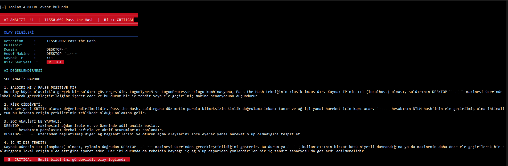
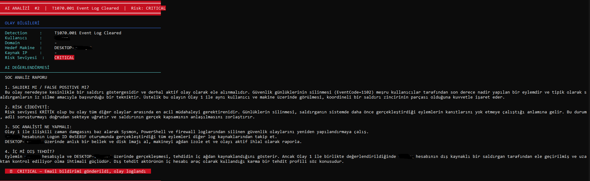
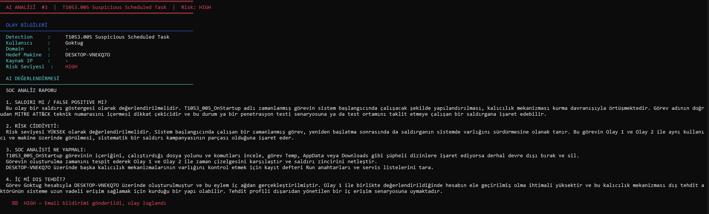
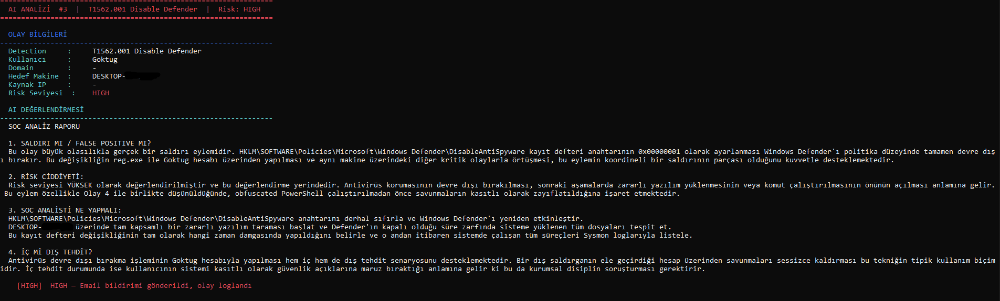
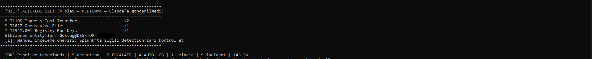
The orchestration layer runs all 25 MITRE detections and Brute Force, scores each event through L2 triage, and sends only ESCALATE events to Claude AI. Severity banners (CRITICAL / HIGH) drive the response actions.

### Cascading Triage — Score-Based Routing
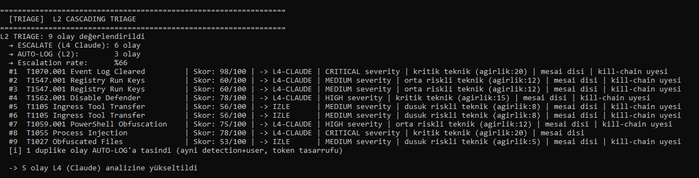
Each event gets a 0–100 score with a breakdown (severity, technique weight, off-hours, kill-chain membership) and is routed to L4-CLAUDE / MONITOR / AUTO-LOG.

### Kill-Chain Correlation
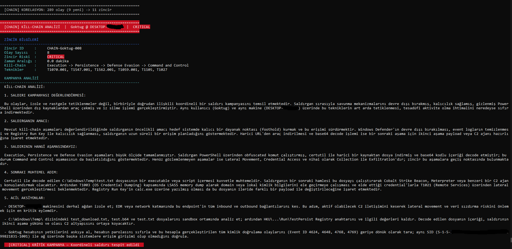
Events on the same user/host are linked into a campaign and analyzed by Claude as a single intrusion (e.g. `Execution → Persistence → Defense Evasion → Command and Control`).

### Semantic Retrieval — Case Memory (L3)
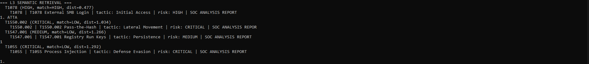
For every new event, the local ChromaDB store surfaces the nearest past cases by MITRE technique, tactic, and risk — injected into Claude's prompt as precedent. Matches are graded HIGH / MEDIUM / LOW instead of a raw distance, so the AI reasons with historical context rather than a blank slate.

### Semantic Index — Representative Selection
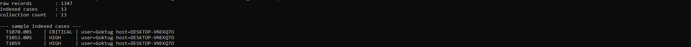
The raw log carried ~45× redundancy (one technique alone dominated with hundreds of near-identical rows). The index unit is the unique `(technique_id, user, host)` pattern — collapsing 1,300+ raw records into a handful of representative cases, so the vector space holds signal, not copies.

### Hash-Chain Incident Log
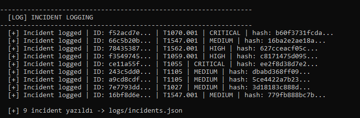
Each incident is chained to the previous one via SHA-256. Tampering with any record breaks the chain.

### MITRE ATT&CK Alerts in Splunk
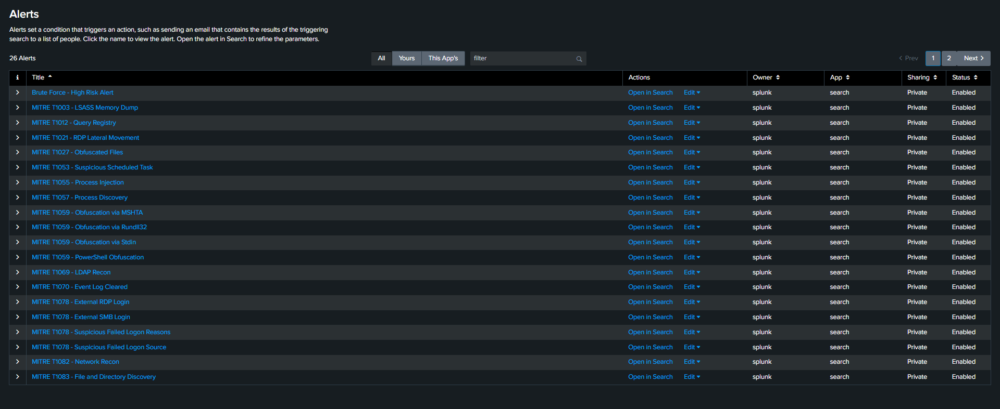
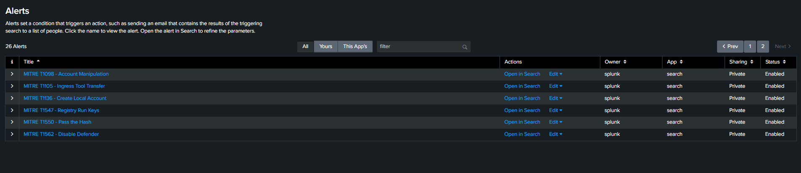
All detections registered as scheduled alerts (every 5 minutes), with per-technique severity.

### Claude AI — Attack-Chain Analysis
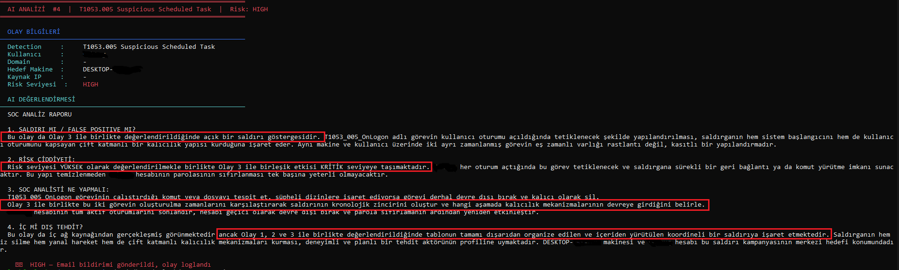
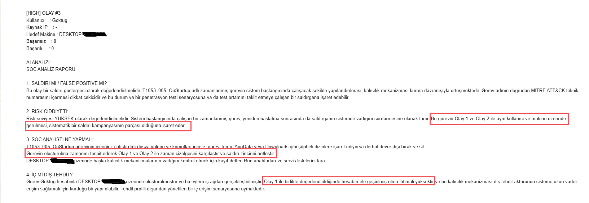
Claude analyzes each event with injected MITRE context and connects related events into a single coordinated intrusion.

### Attack Simulation — Atomic Red Team

Techniques simulated with Atomic Red Team and validated against the resulting Sysmon/Security telemetry in Splunk.

### Email Notification
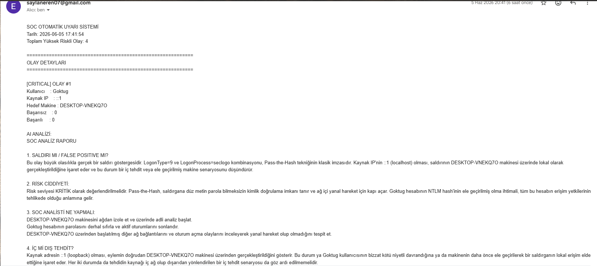
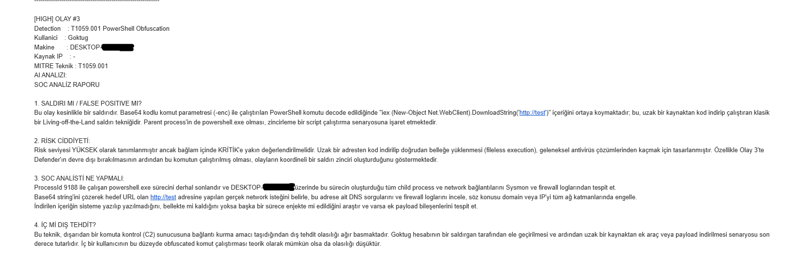
Detailed automated email notifications for CRITICAL and HIGH severity events, with AI analysis and MITRE technique ID in the body.

### Incident Log File
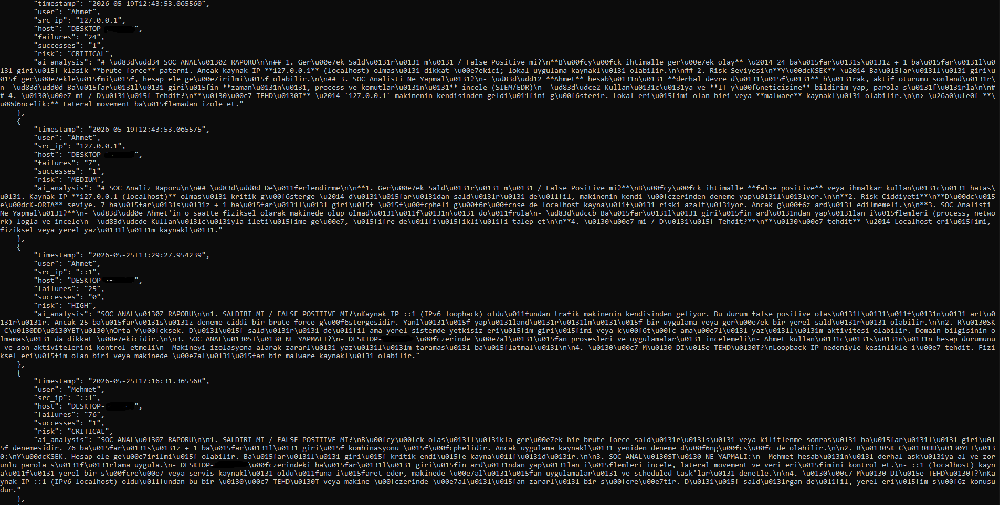
All detected events are stored with timestamps and chained hashes in `logs/incidents.json`.

### IOC Enrichment — Artifact-Driven Threat Intel
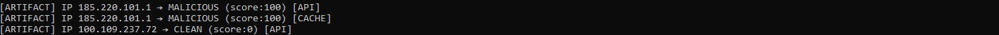
Each indicator is queried once against AbuseIPDB + OTX, cached, and reused. `[API]` on first sight, `[CACHE]` on every reuse — the same IP never costs two calls.

### IOC-Aware Triage — Verdict-Driven Escalation
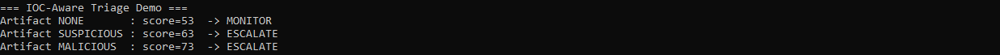
A malicious artifact verdict adds +20 to the L2 score, turning a MONITOR into an ESCALATE. The same external-login event scored three ways shows the flip.

### Trend-Based Escalation
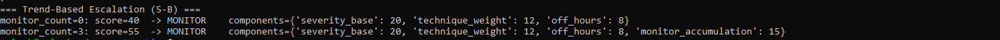
Repeated MONITOR verdicts on the same user/host accumulate; 3+ adds +15, lifting a slow-burn persistence pattern out of suppression.

### L1 Throttling
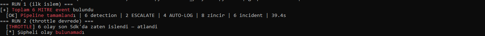
On a second consecutive run, events already processed in the last 5 minutes are skipped — the continuously-running pipeline stops re-analyzing persistent telemetry.

### Knowledge Base — Scope-Aware Exceptions
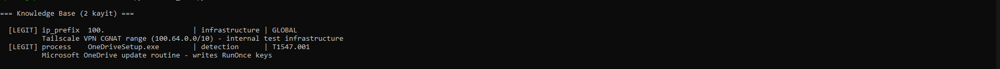
Analyst-curated exceptions carry a scope: `infrastructure` (legitimate everywhere, e.g. a VPN range) or `detection` (legitimate only for the listed techniques, e.g. a signed updater for one persistence key). Added in one line via the `kb_add.py` CLI.

### Scope Enforcement — No Silent Widening
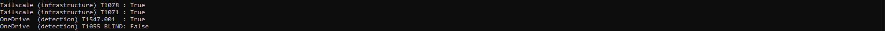
A `detection`-scoped exception never widens beyond its techniques. The Tailscale range (`infrastructure`) is legitimate under any technique; the OneDrive updater (`detection`, T1547.001) is trusted for that persistence key but **still flagged if it shows up doing process injection (T1055)** — a narrow allowance can't quietly become a bypass primitive.

### The "C2" False Positive — Detected, Then Resolved
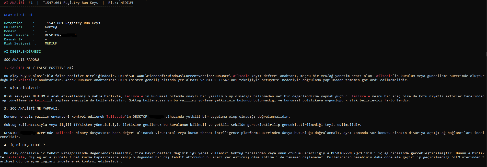
Claude first flagged the analyst's own Tailscale tunnel (a RunOnce persistence key) as attacker C2 — technically correct, contextually wrong.

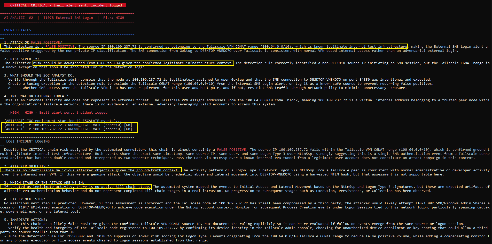
With the Tailscale range registered in the knowledge base as `infrastructure` scope, the same event is now resolved: IOC enrichment returns `known_legitimate` (`[KB]`), and Claude declares a **verified false positive**, downgrading HIGH → LOW and correctly identifying `100.64.0.0/10` as internal infrastructure rather than an external threat.

---

## Installation

**1. Clone & install dependencies**

```bash
git clone https://github.com/thesaep/ai-soc-automation.git
cd ai-soc-automation
pip3 install -r requirements.txt
```

**2. Configure environment**

```bash
cp .env.example .env
# Fill in your values
```

| Key | Description |
|-----|-------------|
| `SPLUNK_HOST` | Splunk server IP |
| `SPLUNK_PORT` | REST API port (default: 8089) |
| `SPLUNK_USERNAME` | Splunk username |
| `SPLUNK_PASSWORD` | Splunk password |
| `SPLUNK_URL` | Full URL (e.g. `https://localhost:8089`) |
| `ANTHROPIC_API_KEY` | Anthropic API key |
| `EMAIL_SENDER` | Gmail address |
| `EMAIL_PASSWORD` | Gmail app password |
| `EMAIL_RECEIVER` | Alert recipient |
| `SEARCH_EARLIEST` | Search window (e.g. `-3h`) |
| `TRIAGE_THRESHOLD` | Escalation cutoff (default: 60) |
| `ABUSEIPDB_API_KEY` | AbuseIPDB API key (free tier: 1000 queries/day) |
| `OTX_API_KEY` | AlienVault OTX API key (free) |
| `IOC_CACHE_TTL_HOURS` | IOC enrichment cache TTL in hours |


> Never commit `.env`. It is gitignored. Only `.env.example` (with placeholders) is tracked.

**3. Deploy Splunk field extraction**

```bash
cp splunk/local/props.conf /opt/splunk/etc/system/local/
cp splunk/local/transforms.conf /opt/splunk/etc/system/local/
sudo -u splunk /opt/splunk/bin/splunk restart
```

**4. Create detection alerts**

```bash
python3 create_alerts.py
```

Registers all 25 MITRE detections (+ brute force) as scheduled Splunk alerts (`*/5 * * * *`). Re-run any time you update a rule — idempotent upsert syncs the changes.

**5. (Optional) Seed the knowledge base**

```bash
# Mark your own VPN / infrastructure ranges as known-legitimate
python3 kb_add.py --ip-prefix "100." --reason "Tailscale VPN range" --scope infrastructure
python3 kb_add.py --list
```

The knowledge base lives in `logs/` and is gitignored — each deployment curates its own exceptions.

**6. Run the SOAR pipeline**

```bash
python3 soar_playbook.py
```

---

## Detection Rules (Sigma → SPL)

Community Sigma rules are converted to Splunk SPL:

```bash
sigma convert -t splunk -p splunk_windows <rule.yml> | tr -d '\r' > <rule.spl>
```

Each rule lives in `queries/sigma_converted/<tactic>/` and is loaded at runtime — never hardcoded in Python. Adding a technique means dropping a `.spl` file and adding one line to the detection list.

> **SPL gotcha (Phase 3):** backslash wildcards like `Image="*\certutil.exe"` work in the Splunk UI but silently return nothing through the REST API. Use command-line matching instead: `CommandLine="*certutil*"`.

> **Dedup gotcha (Phase 5):** a single action can emit many Sysmon events (one registry write → five `EventCode 13` events), inflating the triage row count and the kill-chain membership bonus. Rules now dedup on EventCode-appropriate fields (process: `Image CommandLine User`; registry: `TargetObject Image`; external logon: `Account_Name Source_Network_Address`). Naturally-singular detections (log clear, recon) are left as-is.

---

## File Structure

```
ai-soc-automation/
├── README.md
├── .env
├── .env.example
├── .gitignore
├── requirements.txt
├── splunk_connector.py          # Splunk API connector + event normalization + 25 detections
├── ai_analyzer.py               # Claude analyzer + batching + kill-chain + retrieval/KB context
├── soar_playbook.py             # Main orchestrator (detect → triage → enrich → retrieve → AI → log → correlate)
├── triage_scorer.py             # L2 cascading triage scorer (ESCALATE / MONITOR / SUPPRESS)
├── ioc_enricher.py              # AbuseIPDB + OTX enrichment, cache, IOC extraction, KB check
├── artifact_store.py            # Artifact CRUD, enrichment binding, pivot queries
├── semantic_retriever.py        # L3 ChromaDB indexing + retrieval (representatives, build_query/document)
├── knowledge_base.py            # Scope-aware exceptions (legitimate_tool + closed_case)
├── kb_add.py                    # CLI for fast knowledge-base entries (--scope: infrastructure/detection)
├── correlator.py                # Kill-chain correlation engine (user/host or source-IP based)
├── incident_logger.py           # Hash-chain incident logger (schema v2.1, enrichment block)
├── create_alerts.py             # Creates/updates Splunk alerts (idempotent upsert)
├── mitre_context.json           # MITRE technique knowledge base for the AI layer
├── queries/
│   ├── brute_force.spl          # Phase 1 detection (risk-scored)
│   └── sigma_converted/         # 25 Sigma → SPL MITRE rules
│       ├── command_and_control/
│       ├── credential_access/
│       ├── defense_evasion/
│       ├── discovery/
│       ├── execution/
│       ├── initial_access/
│       ├── lateral_movement/
│       └── persistence/
├── splunk/local/
│   ├── props.conf               # Field extraction (Phase 2 normalization)
│   └── transforms.conf
├── logs/                        # gitignored — runtime state, per-deployment
│   ├── incidents.json           # Hash-chain incident log (schema v2.1)
│   ├── artifacts.json           # IOC artifacts with enrichment + seen_count
│   ├── ioc_cache.json           # Threat-intel cache (1h TTL)
│   ├── knowledge_base.json      # Scope-aware exceptions (analyst-curated)
│   ├── monitor_trend.json       # MONITOR accumulation counter (trend detection)
│   └── throttle_cache.json      # L1 throttle state (5min TTL, ephemeral)
├── chroma_db/                   # gitignored — local ChromaDB vector store (L3 index)
└── screenshots/                 # Project screenshots
```

---

## Write-Ups

| Phase | Medium Article |
|-------|---------------|
| Phase 1 | [Brute-force detection, risk scoring, AI triage, SOAR](https://erensaylan.medium.com/designing-an-ai-powered-soc-automation-platform-with-splunk-and-claude-ai-part-1-d75a173a5f2d) |
| Phase 2 | [From one rule to a MITRE ATT&CK detection engine](https://medium.com/@erensaylan/designing-an-ai-powered-soc-automation-platform-with-splunk-and-claude-ai-part-2-169c67e4181b) |
| Phase 3 | [Reasoning trace, kill-chain correlation, cascading triage](https://medium.com/@erensaylan/designing-an-ai-powered-soc-automation-platform-with-splunk-and-claude-ai-part-3-99d3292e9dfc) |
| Phase 4 | [Artifact-driven IOC enrichment, IOC-aware triage, trend-based escalation](https://medium.com/@erensaylan/designing-an-ai-powered-soc-automation-platform-with-splunk-and-claude-ai-part-4-ecaded2d5d69) |
| Phase 5 | [Semantic retrieval (L3), scope-aware knowledge base, and closing the "C2" false positive](https://medium.com/@erensaylan/designing-an-ai-powered-soc-automation-platform-with-splunk-and-claude-ai-part-5-cc2f331c92a5) |

---

## License

MIT
