# AI-Powered SOC Automation Platform

Splunk, Python ve Claude AI kullanarak geliştirilmiş modüler bir SOC otomasyon platformu. Brute force(şuanlık sadece brute force, ileride kapsam daha da genişletilecektir) saldırılarını otomatik tespit eder, AI ile analiz eder ve email ile bildirim gönderir.

## Mimari

Windows Host (Log Kaynağı)
↓ Universal Forwarder
Ubuntu VM (Splunk Enterprise)
↓ REST API
Python (Anomali Tespiti)
↓ Claude API
AI Analiz + SOAR Playbook
↓
Email Bildirimi + Incident Log

## Özellikler

- **Brute Force Detection** — Splunk SPL ile gelişmiş tespit kuralları
- **Risk Skorlama** — CRITICAL / HIGH / MEDIUM / LOW seviyeleri
- **AI Analiz** — Claude Sonnet ile false positive filtreleme
- **Otomatik Email Bildirimi** — Yüksek riskli olaylar için
- **Incident Log Sistemi** — JSON formatında kalıcı kayıt
- **Multi-Value Field Handling** — Windows Türkçe lokalizasyon desteği
- **Makine Hesabı Filtreleme** — False positive azaltma

## Tech Stack

| Bileşen | Teknoloji |
|---------|-----------|
| SIEM | Splunk Enterprise 9.3 |
| Backend | Python 3.10 |
| AI | Claude Sonnet 4.6 (Anthropic) |
| OS (Sunucu) | Ubuntu Server 22.04 |
| OS (Endpoint) | Windows 10/11 |
| Log Forwarder | Splunk Universal Forwarder |

## Ekran Görüntüleri

### Splunk Dashboard — Brute Force Detection
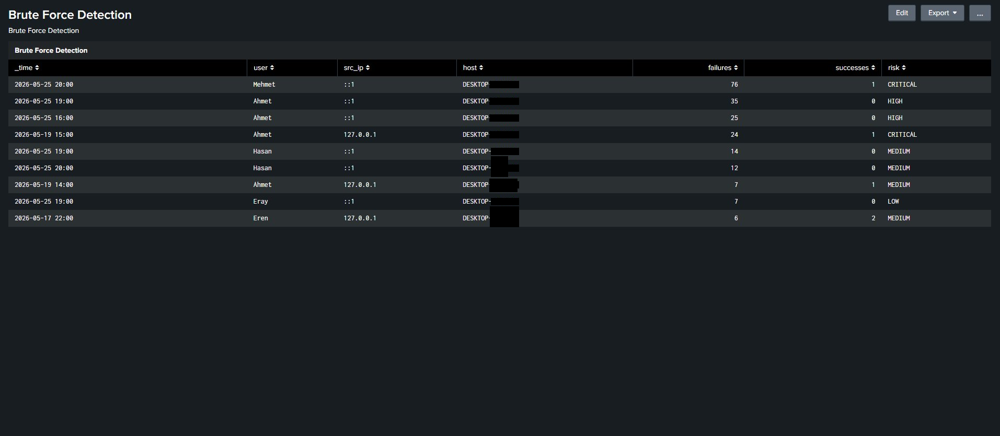

Tüm risk seviyelerinde brute force aktivitesini gösteren ana dashboard. CRITICAL ve HIGH riskli olaylar üst sıralarda görünür.

### Alert Kuralı
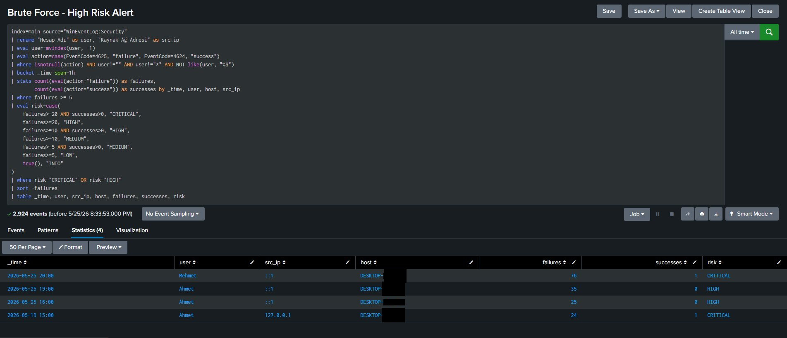

CRITICAL ve HIGH seviyedeki olayları yakalayan, her 5 dakikada bir çalışan otomatik alert.

### Python SOAR Playbook — CRITICAL Olay Analizi
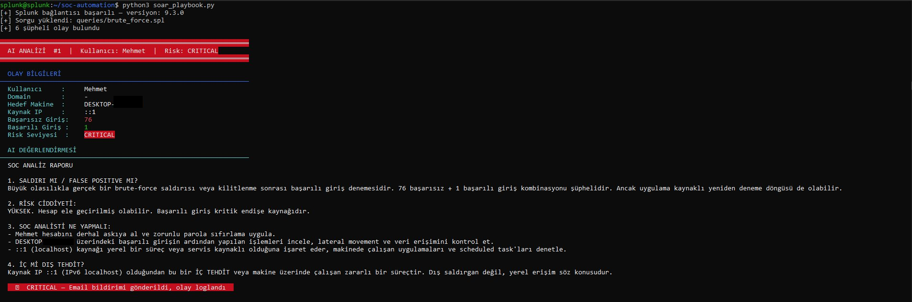

Claude AI'ın CRITICAL seviyedeki olayı analiz ettiği ve email bildiriminin tetiklendiği örnek.

### Python SOAR Playbook — HIGH Olay Analizi
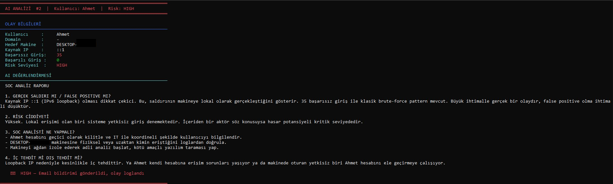
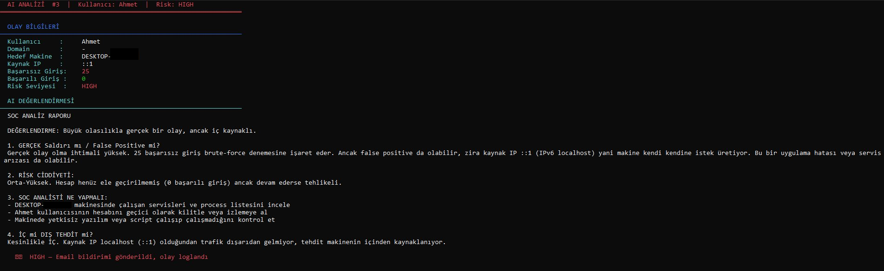

35 ve 25 başarısız giriş içeren HIGH seviyedeki brute force olaylarının analizi.

### Python SOAR Playbook — LOW Olay Analizi
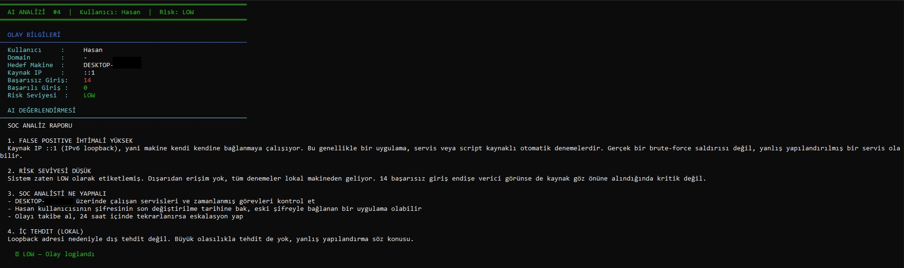
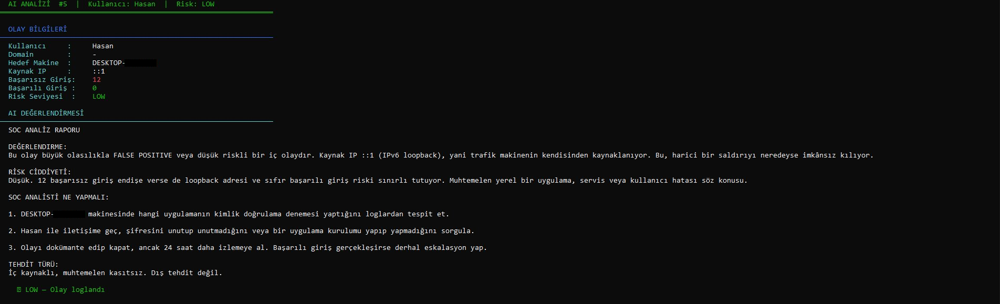
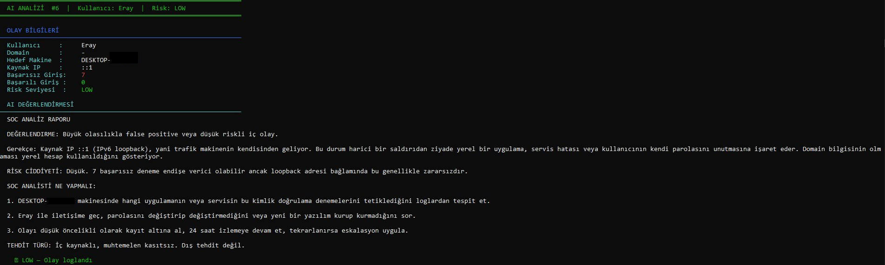

Düşük riskli olaylar için sistem sadece loglar, email göndermez. AI false positive ihtimalini değerlendirir.

### Email Bildirimi
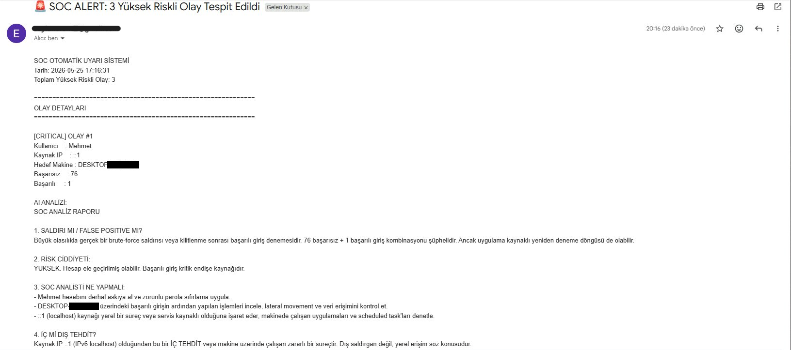
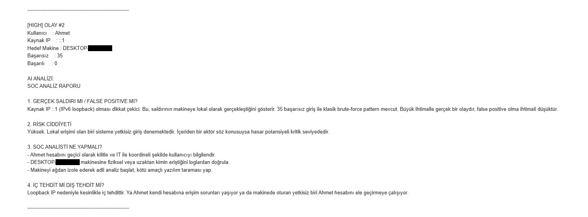
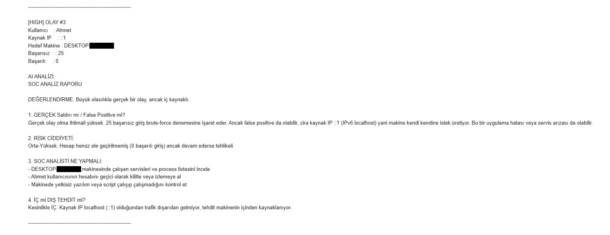

CRITICAL ve HIGH seviyeli olaylar için otomatik gönderilen detaylı email bildirimi. AI analizi de email içeriğine dahil edilir.

### Incident Log Dosyası
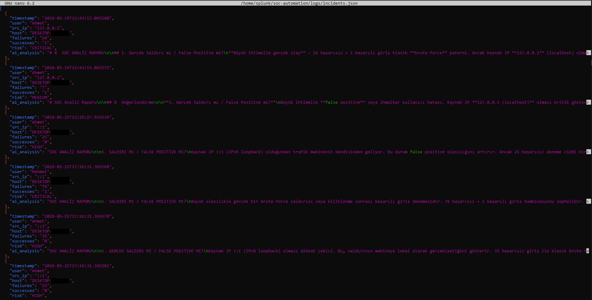
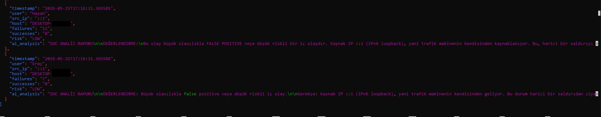

Tüm tespit edilen olaylar zaman damgalı olarak `logs/incidents.json` dosyasında saklanır. AI analizi de log'a dahildir.

## Risk Skorlama Mantığı

| Risk | Koşul | Aksiyon |
|------|-------|---------|
| CRITICAL | 20+ failure + 1+ success | Email + Log + AI Analiz |
| HIGH | 20+ failure (başarısız) | Email + Log + AI Analiz |
| HIGH | 10-20 failure + success | Email + Log + AI Analiz |
| MEDIUM | 10-20 failure | Log + AI Analiz |
| MEDIUM | 5-10 failure + success | Log + AI Analiz |
| LOW | 5-10 failure | Log + AI Analiz |

## Kurulum

1. `.env.example` dosyasını `.env` olarak kopyala
2. Gerekli değerleri doldur (Splunk credentials, Anthropic API key, Email)
3. Bağımlılıkları yükle:
```bash
   pip3 install -r requirements.txt
```
4. Çalıştır:
```bash
   python3 soar_playbook.py
```

## Dosya Yapısı
ai-soc-automation/
├── README.md
├── .env                       # Gizli bilgiler (gitignore'da)
├── .gitignore
├── requirements.txt
├── splunk_connector.py        # Splunk API bağlantısı
├── ai_analyzer.py             # Claude AI tehdit analizi
├── soar_playbook.py           # SOAR playbook (email + log)
├── queries/
│   └── brute_force.spl        # SPL sorgusu (harici dosya)
├── logs/
│   └── incidents.json         # Incident log dosyası
└── screenshots/               # Proje ekran görüntüleri

## Yol Haritası

- [x] Faz 1 — Splunk + Python + AI + SOAR temel altyapısı
- [ ] Faz 2 — Log Normalizasyonu ve Field Extraction
- [ ] Faz 3 — MITRE ATT&CK Threat Hunting
- [ ] Faz 4 — Multi-Event Korelasyon Kuralları
- [ ] Faz 5 — Multi-Tier Splunk Mimarisi
